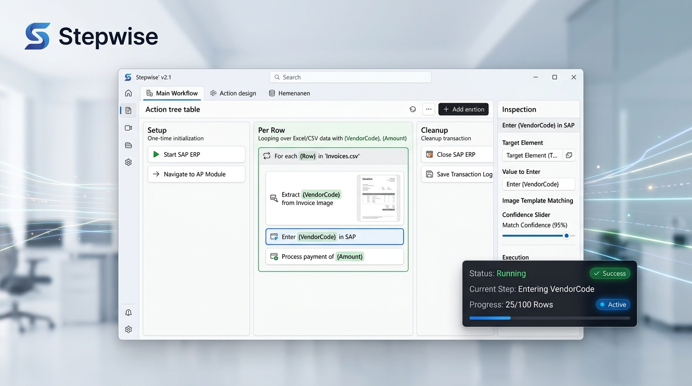
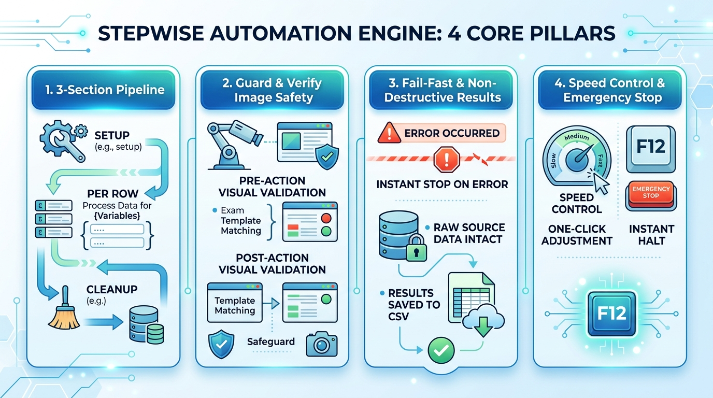
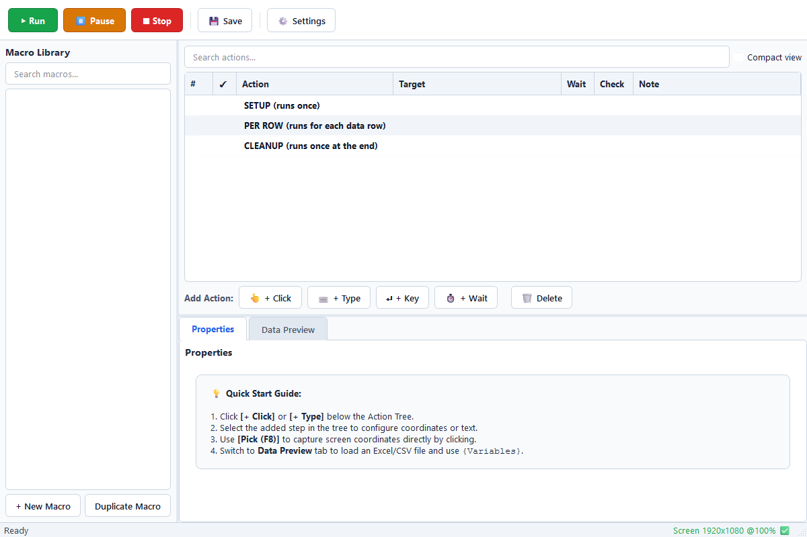

*Read this in other languages: [English](README.md), [한국어](README.ko.md)*

#  Stepwise

<p align="center">
  
</p>

<p align="center">
  
  
  
  
  
  
</p>

> **Reliable, data-driven desktop automation for enterprise legacy ERPs (SAP GUI) and internal web portals.**  
> Seamlessly iterate through Excel/CSV tables, confirm screen states via computer vision, and execute safe workflows without code or administrative privileges.

---

## 💡 Why Stepwise?

In enterprise environments, operational teams manually key in hundreds of journal entries, invoices, and master records daily into legacy ERPs or locked-down corporate portals.

- **Lack of APIs & High Development Costs**: Establishing batch interfaces or custom APIs for legacy systems often requires exorbitant SI budgets and lengthy security clearance cycles.
- **Dangers of Blind Macro Tools**: Standard auto-clickers execute blindly without verifying screen status, causing catastrophic duplicate transactions, missed fields, or erroneous data entries whenever the network lags.
- **Privilege & Deployment Barriers**: Heavy RPA solutions are expensive, convoluted, and demand IT Administrator rights that typical office workers do not possess.

**Stepwise** was created by business practitioners to bridge this exact operational gap. By binding column values directly to variables (`{VendorCode}`, `{Amount}`), validating visual conditions with OpenCV template matching, and adhering to an uncompromising **Fail-Fast Safety Principle**, Stepwise delivers dependable, enterprise-grade automation straight into the hands of business users.

---

## 🛡️ 4 Core Pillars of Stepwise

<p align="center">
  
</p>

### 1. 3-Section Pipeline (Setup / Per Row / Cleanup)
Workflows are structured into an intuitive, sequential 3-part hierarchy:
- **Setup (1x Init)**: Open ERP application, enter T-Code, and prepare target screens.
- **Per Row (Loop)**: Automatically iterate over each row of an Excel/CSV file, substituting `{Variables}` into form inputs and click targets.
- **Cleanup (1x Teardown)**: Finalize batch reports, save session state, and cleanly close windows.

### 2. Guard & Verify Image Safety (Computer Vision Validation)
- **Guard (Pre-action Check)**: Verifies that prerequisite dialogs or elements are visible before attempting input.
- **Verify (Post-action Check)**: Validates that expected completion banners or confirmation dialogs have appeared.
- **Interactive Capture Helpers**: Press `F8` to pick screen coordinates instantly or `F9` to freeze the display and drag-select template match areas.

### 3. Fail-Fast & Non-Destructive Results
- If an unexpected screen or timeout occurs, Stepwise **halts immediately** rather than guessing or double-clicking.
- Source data files (`.xlsx`, `.csv`) are **never modified or corrupted**.
- Real-time row-by-row status and failure diagnostic screenshots are logged directly to a standalone Results CSV, enabling instantaneous **Resume Execution** from the pending row.

### 4. Smart Speed Control & F12 Emergency Stop
- Seamlessly adjust global timing delays on high-latency remote desktops with one click: **Normal / Slow (+0.5s) / Very Slow (+1.0s)**.
- Press **F12** at any moment for an instant, zero-latency emergency shutdown.

---

## 🖥️ Application UI Preview

<p align="center">
  
</p>

---

## 🚀 Quick Start

### 1. Install via User Installer (For General Users)
Installs cleanly into user space (`%LOCALAPPDATA%\Programs\Stepwise`) without requiring IT administrator rights.
- Download and run [release/dist/Stepwise-Setup-0.1.0.exe](release/dist/Stepwise-Setup-0.1.0.exe)
- Launch `Stepwise` directly from your Desktop shortcut or Start Menu.

### 2. Run from Source (For Developers)
```cmd
# 1. Clone repository & configure virtual environment
git clone https://github.com/KwangBeomPark/06_Stepwise.git
cd 06_Stepwise
python -m venv .venv
.venv\Scripts\activate

# 2. Install dependencies
pip install -r requirements.txt

# 3. Launch application
python -m stepwise
```
*(Alternatively, simply double-click [run_app.bat](run_app.bat) to launch the app automatically).*

---

## 🧪 Quality Gates & Verification

Stepwise is engineered to rigorous quality and reliability standards:

| Inspection Area | Tooling | Result | Details |
| :--- | :--- | :---: | :--- |
| **Unit & Integration Tests** | `pytest` | **42 / 42 PASSED** | Models, variable substitution, Win32 SendInput, template matcher, and runner |
| **Code Style & Linting** | `ruff` | **0 Warnings, 0 Errors** | Strict PEP 8 & modern Python clean code conventions |
| **Windows OS Spikes** | Win32 API | **9 / 9 PASSED** | DPI scaling, virtual screen capture, session lock events, F12 global hotkey |
| **Packaging & Installer** | PyInstaller + Inno Setup | **SUCCESS** | Standalone installer (`Stepwise-Setup-0.1.0.exe`, 71.5 MB) generated |

---

## 📂 Repository Structure

```text
06_Stepwise/
├── assets/
│   └── images/              # High-fidelity visual diagrams & banners
├── docs/
│   ├── it-request.md        # Corporate IT & EDR security whitelist request
│   └── m0-report.md         # Windows OS spike & technical validation report
├── installer/
│   ├── stepwise.iss         # Inno Setup 6 non-admin installer script
│   └── stepwise.spec        # PyInstaller onedir optimization bundle spec
├── release/dist/
│   └── Stepwise-Setup-0.1.0.exe # Standalone distribution installer
├── src/stepwise/
│   ├── app.py / __main__.py # Application entry point & Qt initialization
│   ├── cli.py               # Standalone headless / CLI runner
│   ├── core/                # Data models, schema, .swm package, variable interpolation
│   ├── engine/              # 3-section execution engine, timing, real-time results CSV
│   ├── services/            # Win32 SendInput, DPI/capture, OpenCV matcher, hotkeys
│   └── ui/                  # PySide6 modern UI (Action tree, dynamic properties, HUD)
├── tests/                   # pytest unit and integration test suite
├── tools/
│   ├── dummy_erp.py         # Mock ERP simulator for end-to-end integration validation
│   └── spike/               # Standalone Win32 spike verification scripts
└── stepwise-dev-guide.md    # Complete technical design & development specification
```

---

## 👨‍💼 Project Background

This project was conceived and built not in a software vacuum, but from real-world **Finance and Business Operations experience**.

Having experienced firsthand the exhaustion and risks of manual data entry in legacy corporate environments, Stepwise was crafted to eliminate the tedious pain points of enterprise tasks with an unwavering emphasis on **simplicity, precision, and safety-first execution**.

---

## 📄 License

This project is licensed under the [MIT License](LICENSE).
